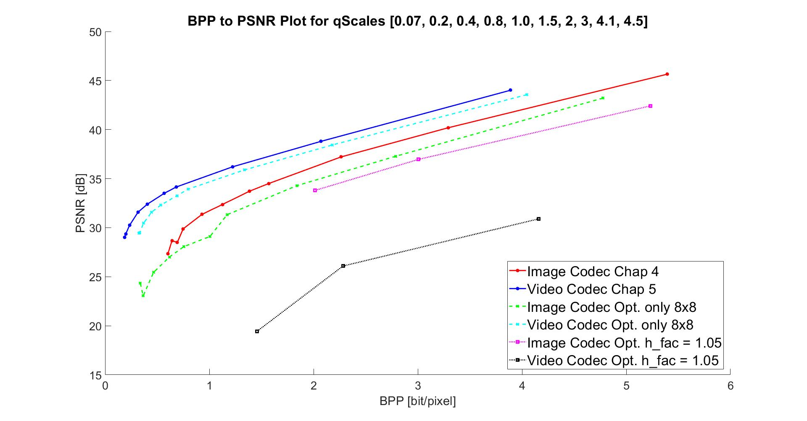

# What This?

This repo contains the code for the final optimazation task of the IVC Lab at TUM. I decided to create a codec that relies on an original idea, which is to treat subframes of images differently depending on the information that is contained in it. For more information refer to the 3 min presentation in the "Alexander_Prommesberger_Final_Opt.zip". 

# To Run the Code
  
1. Open Alexander_Prommesberger_FinalOpt.m
2. Select the path to your images and add myfunctions, IVC Huffman and Data for plot folders to path!
3. Press Run to run with default Parameters --> only 8x8 Prediction is used! h_fac  =5; qScales = [0.07, 0.2, 0.4, 0.8, 1.0, 1.5, 2, 3, 4.1, 4.5];

3. Play arount with the parameters, describtion in Alexander_Prommesberger_FinalOpt.m
	- If 4x4 PRed should be used: h_fac = 1.05 is recommended --> qScale should be below 0.5! for ex. qScales = [0.07, 0.2, 0.4];
	- EOB should not be under 4000, could raise decoding problems!
    - max_displacement=4 is good value, if lower, bpp could raise, run time problems if to high !

# To Plot the Curves:
  Go into Data for Plot and run PlotSkript_FinalResults

# Presentation:
  Go into Presentation and open the mp4 file (Volumne adjustments might be necessary!)

# Results

